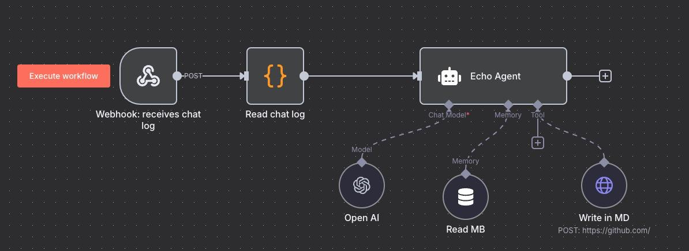

# Socrates VS Code Extension

> **Preserve and organize your GitHub Copilot chat history with intelligent export and documentation capabilities**

[](https://www.typescriptlang.org/)
[](https://code.visualstudio.com/)
[](https://nodejs.org/)

## 🎯 Overview

Socrates is a VS Code extension that automatically captures, exports, and organizes your GitHub Copilot chat history into beautifully formatted Markdown files. Built with a modular architecture and designed for extensibility, Socrates transforms your AI conversations into a searchable knowledge base while preparing for advanced automation capabilities.

## ✨ Current Features

### 🚀 **Phase 1: Database Layer** ✅
- **Layered Modular Architecture**: Clean separation of concerns with DatabaseReader, QueryBuilder, and ConnectionManager
- **SQLite Integration**: Direct access to VS Code's workspace chat database (`state.vscdb`)
- **Robust Error Handling**: Graceful handling of database connection issues and query failures

### 📄 **Phase 2.1: Export Pipeline** ✅
- **Template Method Pattern**: Consistent export structure with customizable formatting
- **Strategy Pattern**: Flexible markdown formatting with `DefaultMarkdownFormatter`
- **GitHub Copilot Branding**: Specialized exporter with Copilot-specific metadata and context
- **Atomic File Operations**: Safe file writing with retry logic and conflict resolution
- **Programming Language Detection**: Automatic detection and tagging of discussed languages

### 🎨 **Export Features**
- **Clean Markdown Output**: Professional formatting with role distinction (👤 User / 🤖 Assistant)
- **Code Block Preservation**: Syntax highlighting and proper formatting for code snippets
- **Session Metadata**: Timestamps, duration, message counts, and session context
- **File Organization**: Automatic `.socrates` directory creation with date-based subdirectories
- **Conflict Resolution**: Smart file naming to prevent overwrites

## 🏗️ Architecture

```
src/
├── database/           # Phase 1 - Data Access Layer
│   ├── DatabaseReader.ts      # Main database interface
│   ├── QueryBuilder.ts        # SQL query construction
│   └── ConnectionManager.ts   # Connection handling
├── export/            # Phase 2.1 - Export Pipeline
│   ├── types.ts               # Core interfaces
│   ├── DefaultMarkdownFormatter.ts  # Strategy implementation
│   ├── BaseMarkdownExporter.ts      # Template Method base
│   ├── GitHubCopilotExporter.ts     # Copilot-specific exporter
│   └── index.ts               # Module exports
├── file/              # Phase 2.1 - File Management
│   ├── FileManager.ts         # Atomic file operations
│   └── index.ts               # Module exports
└── monitor/           # Phase 2.2 - Background Monitoring (In Progress)
    └── (Coming Soon)
```

## 🚀 Installation

### Prerequisites
- VS Code 1.101.0 or higher
- Node.js 18+ (for development)
- TypeScript 5.8+ (for development)

### From Source
```bash
# Clone the repository
git clone https://github.com/your-username/socrates.git
cd socrates

# Install dependencies
npm install

# Build the extension
npm run build

# Install in VS Code
code --install-extension socrates-*.vsix
```

## 📖 Usage

### Automatic Export
Once installed, Socrates works automatically in the background:

1. **Start a Copilot Chat**: Use GitHub Copilot chat as normal
2. **Automatic Detection**: Socrates monitors for new chat sessions
3. **Export Generation**: Sessions are automatically exported to `.socrates/YYYY-MM-DD/` folders
4. **Markdown Files**: Each session becomes a timestamped `.md` file with full formatting

### File Structure
```
your-project/
├── .socrates/
│   ├── 2024-01-15/
│   │   ├── 2024-01-15T10-30-00_TypeScript_Help.md
│   │   └── 2024-01-15T14-15-30_Debug_Session.md
│   └── 2024-01-16/
│       └── 2024-01-16T09-00-00_API_Design.md
├── src/
└── package.json
```

### Sample Export
```markdown
# GitHub Copilot Chat Session

This document contains a conversation with GitHub Copilot, an AI-powered coding assistant.

## Session Information
- **Start Time**: 1/15/2024, 10:30:00 AM
- **Duration**: 15 minutes
- **Messages**: 8
- **Languages Discussed**: typescript, javascript

## GitHub Copilot Context
- **AI Model**: GitHub Copilot
- **Interaction Type**: Chat Session
- **Session Topic**: TypeScript Interface Design

## Messages

### 👤 User *(10:30:15 AM)*
How do I create a TypeScript interface for user data?

### 🤖 Assistant *(10:30:18 AM)*
You can create a TypeScript interface like this:

```typescript
interface User {
  id: string;
  name: string;
  email: string;
  createdAt: Date;
  isActive?: boolean;
}
```
```

## 🛣️ Roadmap

### 🔄 **Phase 2.2: Background Monitoring** (In Progress)
- **Hybrid Smart Polling**: 10-second active monitoring, 60-second inactive intervals
- **Activity Detection**: VS Code focus and typing event awareness
- **Error Recovery**: Exponential backoff and graceful failure handling
- **State Persistence**: Maintain monitoring state across VS Code restarts

### 🎨 **Phase 2.3: UI Integration** (In Progress)
- **Status Bar Integration**: Minimal icon with dynamic tooltips
- **Export Status**: Real-time feedback on export operations
- **Theme Integration**: Seamless VS Code theme compatibility
- **Accessibility**: Full screen reader and keyboard navigation support

### 🌐 **Phase 3: Remote Agent Integration** (In Progess)

#### 🤖 **n8n Workflow Integration**



*Agent ECHO n8n Workflow - Updates the memory bank in real time as part of the Socratic Coding Tutor system*

- **Chat History Streaming**: Automatically send exported chat sessions to remote n8n workflows
- **Webhook Integration**: Configurable endpoints for real-time chat data transmission
- **Batch Processing**: Efficient bulk export of historical sessions to n8n agents
- **Authentication**: Secure API key and token-based authentication for remote connections

#### 📁 **Workspace File Access**
- **File System Bridge**: Allow remote n8n agents to access local workspace files
- **Selective Permissions**: Granular control over which files and directories are accessible
- **Read/Write Operations**: Enable agents to read project files and suggest modifications
- **Security Sandbox**: Isolated access patterns to prevent unauthorized file system access

#### 📝 **Intelligent Documentation Maintenance**
- **Automated Documentation Updates**: Let remote agents maintain project documentation based on chat interactions
- **Accuracy Preservation**: Ensure documentation changes reflect actual code and conversation context
- **Version Control Integration**: Automatic commit and PR creation for documentation updates
- **Review Workflow**: Human approval process for agent-suggested documentation changes
- **Context-Aware Editing**: Use chat history context to make relevant and accurate documentation improvements

### 🔮 **Phase 4: Advanced Automation** (Vision)
- **Knowledge Base Building**: Automatic creation of searchable developer knowledge bases

## 🧪 Development

### Setup
```bash
# Install dependencies
npm install

# Run TypeScript compiler
npx tsc --noEmit

# Run tests (when available)
npm test
```

### Architecture Patterns
- **Template Method Pattern**: `BaseMarkdownExporter` with customizable headers/footers
- **Strategy Pattern**: `MarkdownFormatter` interface for flexible formatting
- **Atomic Operations**: Safe file operations with rollback capabilities
- **Layered Architecture**: Clear separation between database, export, and file layers

### Testing
```bash
# Component testing (export pipeline)
npx ts-node src/test-export-pipeline.ts

# TypeScript compilation check
npx tsc --noEmit
```

## 🤝 Contributing

We welcome contributions!

### Development Workflow
1. Fork the repository
2. Create a feature branch (`git checkout -b feature/amazing-feature`)
3. Make your changes following our architecture patterns
4. Add tests for new functionality
5. Commit your changes (`git commit -m 'Add amazing feature'`)
6. Push to the branch (`git push origin feature/amazing-feature`)
7. Open a Pull Request

---

**Socrates** - *"The unexamined code is not worth writing"* 🏛️
